# 🔐 Packet Capture and Analysis of an FTP Brute-Force Attack with Data Exfiltration

## 🧾 Project Overview

In this hands-on project, I simulated a brute-force attack on an FTP server and captured the network traffic using Wireshark to analyze key attack vectors and detect signs of data exfiltration. The project was designed to help me understand common attack techniques, how to detect them, and the importance of proper network traffic analysis for threat detection.

---

## 🛠️ Tools & Technologies Used

- **Kali Linux** (Attacker VM).

- **Metasploitable 2** (Victim VM).

- **Wireshark**: For capturing network traffic and analyzing the packets.

- **Hydra**: For conducting the brute-force attack on the FTP service.

- **FTP Service**: A vulnerable FTP service running on Metasploitable 2.

---

## 🎯 Objectives

- Simulate a Real-World Brute-Force Attack.

- Capture Network Traffic Using Wireshark.

- Analyze Network Traffic for Attack Indicators.

- Perform Data Exfiltration Simulation.

- Evaluate Security Implications of FTP.

- Develop Packet Analysis Skills.

- Improve Threat Detection Techniques.

---

## 📖 Steps Taken

1. Set up a Virtual Lab (Environment Prep) & Network Configuration.

2. Start Capturing Network Traffic.

3. Simulate the Attack (Brute Force FTP Login & Exfiltration).

4. Stop the Capture and Save The PCAP.

5. Analyze the PCAP in Wireshark.

6. Reporting and Documentation.

---

### Step 1: 🧪 Virtual Lab Setup (Environment Preparation)

#### 💻 Lab Configuration Overview

| Component       | Configuration                     |
|----------------|-----------------------------------|
| Host OS         | Windows 10                                                          |
| Attacker        | Kali Linux (VirtualBox VM)                                          |
| Target          | Metasploitable 2 (VirtualBox VM) - Intentionally Vulnerable         |
| Network Type    | Host-Only Adapter (VirtualBox Host-Only Ethernet Adapter)           |
| Attacker IP     | `192.168.56.101`                                                    |
| Target IP       | `192.168.56.102`                                                    | 

This configuration ensures that both virtual machines are on the same isolated network segment, enabling seamless communication between the attacker (Kali Linux) and the target (Metasploitable 2) while keeping the setup secure from external threats.

To ensure secure and isolated communication between the attacker and target machine, the network was configured using VirtualBox's "Host-Only Adapter" mode. This setup allows both virtual machines to interact with each other without any external internet access — an ideal environment for penetration testing.


#### 🔎 Verifying Connectivity:

Once both virtual machines were configured and running, connectivity was verified using the Ping command from Kali terminal:

```
ping 192.168.56.102
```

#### ✅ Outcome:

The successful response from Kali terminal as shown in the screenshot below, confirmed that the virtual environment was properly isolated and communication between the VMs was working as expected.

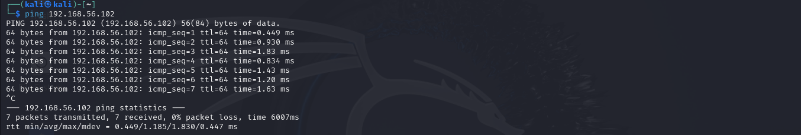
*Kali terminal output showing network connection with Metaspoiltable2 VM.*

---

### Step 2: 📹 Start Capturing Network Traffic

To monitor and analyze the network activity associated with the simulated brute-force attack and FTP data transfer, I used Wireshark to capture live traffic on the network interface.

----

#### 2.1 Launch Wireshark On Kali Linux

On the Kali Linux machine, Wireshark was launched by running:

```
sudo wireshark 
```

Used ```sudo``` because Wireshark needs root privileges to capture packets, which prompted password for user ```kali``` as illustrated in frame 1 of the screenshot below. After submitting the correct password, wireshark launched as seen in frame 2: 

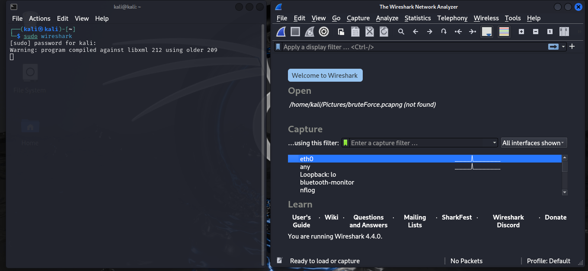
*Screenshot on launching Wireshark in Frame 1, and Wireshark automatically launching thereafter in Frame 2.*

I then selected the appropriate network interface ```eth0``` used to communicate with the Metasploitable machine as shown below:

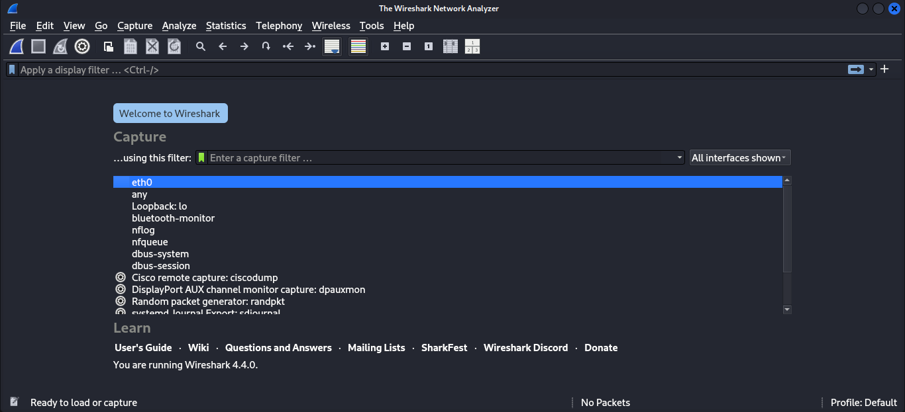
*Screenshot on selecting the right netwotk interface in Wireshark.*

For this project, I started capturing on interface ```eth0``` as this is how Kali was set up. I then clicked the Start Capture button (blue shark fin icon) to start the capture.

As illustrated below, Wireshark was ready and waiting to record all incoming and outgoing network packets:

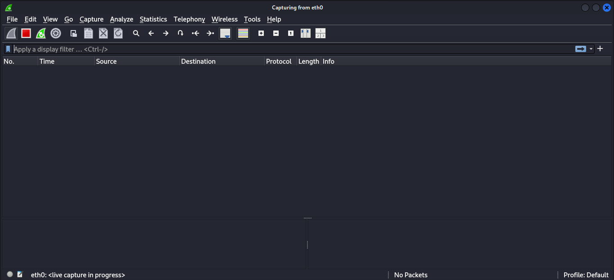
*Screenshot on starting packet capture in Wireshark.*

----

#### 2.2 Testing the Correct Network Interface in Wireshark.

After launching Wireshark and selecting the correct network interface, I tested the network interface chosen by pinging Metaspoiltable target IP in Kali terminal:

```
ping 192.168.56.102
```

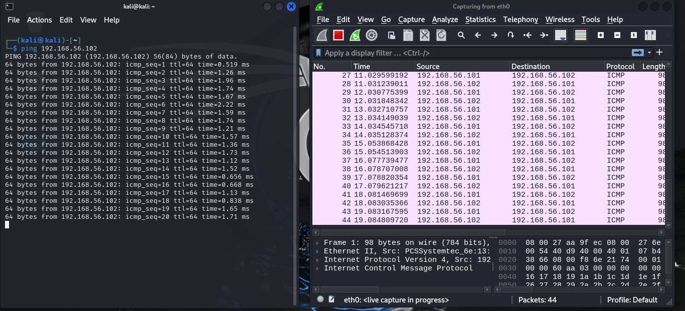
*Screenshot on testing the network interface `eth0` selected.*

📁 Breakdown:

1. With Wireshark side by side to the Kali terminal as illustrated in the screenshot, Wireshark showed ICMP packets.

2. These packets related to the ping request `ping 192.168.56.102` which verified that the correct interface was selected.

This confirms that the interface is actively capturing traffic to/from the target.

📌 Note:

Keep wireshark up and running all through the attack so as to capture and record all traffic, including authentication attempts, login credentials, and file transfers for analysis in the later stages.

This step was essential to simulate and observe how real-world network attacks can be identified through packet-level inspection, making it a core part of the analysis phase in step 5.

---

### Step 3: 💣 Simulate The Attack (Brute Force FTP Login & Exfiltration)

With Wireshark actively capturing traffic in the background, I proceeded to launch a Hydra brute-force attack on the FTP service hosted on Metasploitable 2, followed by manual FTP login and file transfer operations.

---
#### 3.1 Launch Hydra to Brute-Force FTP Login

In this step, I performed a simulated brute-force attack against an FTP service running on the vulnerable Metasploitable 2 machine. 

The goal was to demonstrate how weak credentials can be discovered using automated tools, and to capture this attack in Wireshark for forensic analysis.

Started by running the following command in Kali Linux terminal:

```
hydra -l msfadmin -P /usr/share/wordlists/rockyou.txt ftp://192.168.56.102
```

📁 Breakdown of the command above:

1. ```hydra``` invokes the Hydra tool.

2. ```-l msfadmin``` specifies the username to use - in this case, msfadmin.

3. ```-P /usr/share/wordlists/rockyou.txt``` tells Hydra to use the RockYou wordlist as the list of passwords to try. -P is for password file (uppercase).

4. ```ftp://192.168.56.102``` specifies the protocol (ftp) and the target IP address (192.168.56.102) to attack.

Hydra will attempt to brute-force FTP login to the machine at target IP 192.168.56.102, trying the username `msfadmin` with every password in the RockYou wordlist, as shown in the screenshot below:

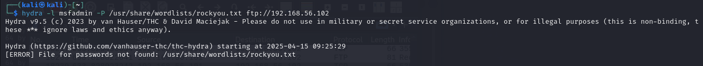
*Screenshot on launching Hydra in Kali terminal to brute-force FTP login.*


From the illustration above, a message can be seen:

```
[ERROR] File for passwords not found: /usr/share/wordlists/rockyou.txt
```

This means that Hydra couldn’t find the rockyou.txt wordlist at the path specified. This happens in fresh Kali Linux installs because rockyou.txt is not extracted by default. So it needed to be extracted first.

To extract rockyou.txt wordlist, I executed the following command to navigate to the directory where rockyou.txt is compressed:

```
cd /usr/share/wordlists
```

After navigating to the directory, I extracted rockyou.txt.gz (the compressed file) by executing:

```
sudo gunzip rockyou.txt.gz
```

I then verified that the file is there by running:

```
ls | grep rockyou
```

This returned ```rockyou.txt```, which verified that the worldlist was extracted successfully.

Below is a visual representation on how the rockyou.txt worldlist was extracted:

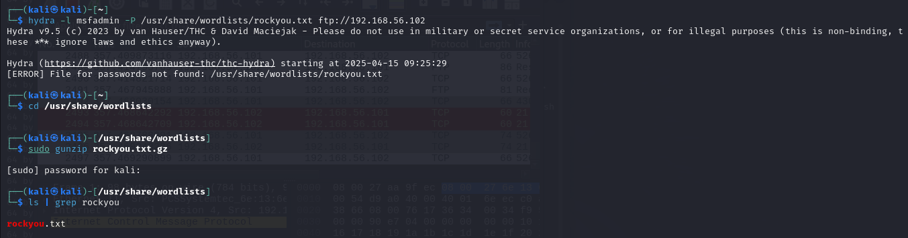
*Screenshot on extracting the compressed rockyou.txt file.*

Lastly, I re-run Hydra which took so long to find a match:

```
hydra -l msfadmin -P /usr/share/wordlists/rockyou.txt ftp://192.168.56.102
```

📌 Here is why Hydra session took long to finish:

When demonstrating brute force attacks for educational or portfolio purposes, using the full rockyou.txt wordlist can be time-consuming and unnecessary. 

The ```rockyou.txt``` is classic, but very huge. It has 14+ million passwords, and Hydra will go through each one unless it finds a match then it stops, or you stop it manually ```(ctrl + c)``` 

To speed up the process and make the demo more efficient, I manually stopped the Hydra session, and used a smaller, truncated version of the wordlist as shown in the next sub-step. 

----

#### 3.2 Created Smaller Version Of The Wordlist rockyou.txt

First, I made a working copy of the default rockyou.txt wordlist via Kali terminal:

```
cp /usr/share/wordlists/rockyou.txt ~/shortlist.txt
```

I then extracted the first 1000 passwords to create a lightweight list for quick testing:

```
head -n 1000 ~/shortlist.txt > ~/ftp-demo-list.txt
```
As shown in the screenshot below:

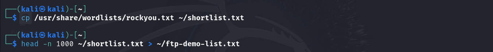
*Screenshot on creating a smaller version of rockyou.txt wordlist to be used for brute-force attack.*

The ```ftp-demo-list.txt``` contains only the first 1000 passwords from that list.

Using a shorter wordlist matters because it ensures faster execution, and supports resource-friendliness as it uses lower CPU and memory during the attack.

Lastly, I executed Hydra to brute force the FTP login using a specific username (msfadmin - a known default credentials for Metaspoiltable 2) and the new, shorter password list:

```
hydra -l msfadmin -P ~/ftp-demo-list.txt ftp://192.168.56.102
```

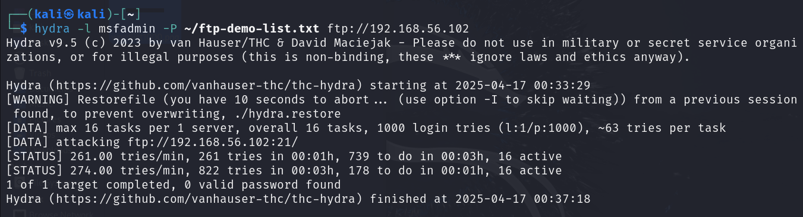
*Screenshot on re-running Hydra to brute-force FTP login using username `msfadmin`.*


The illustration above shows that there was ```0 valid password found```. None of the 1000 passwords matched the credentials for user msfadmin on the target system.

This result highlights a realistic limitation of brute force attacks: success is heavily dependent on the quality and relevance of the wordlist.

I didn't opt to use a larger wordlist segment (e.g., 10,000 entries or more) or perform a full brute force testing on the complete rockyou.txt due to the cost of time, speed, and system resources.

I thought wise to customize a wordlist based on the username msfadmin as illustrated in the next sub-step.

----

#### 3.3 Creating Custom Wordlists for Brute-Force Attack

The default credentials for Metasploitable 2 are usually:

`Username: msfadmin`

`Password: msfadmin`

To simulate a more targeted brute-force attack, I created custom wordlists for both usernames and passwords. These smaller, curated lists are often used in real-world scenarios where an attacker has prior knowledge or educated guesses about potential credentials, making the attack more efficient than using massive dictionaries like rockyou.txt. This was done by running:

```
echo -e "msfadmin\nftp\nanonymous" > ~/usernames.txt

echo -e "msfadmin\nadmin\n123456\npassword" > ~/passwords.txt
```

As illustrated in the screenshot below:

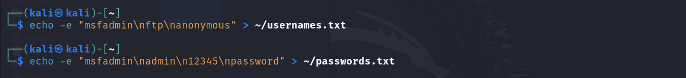
*Screenshot on creating custom worldlists for the brute-force attack.*

📁 Breakdown:

1. The first command creates a file named usernames.txt in the home directory, containing:

   - msfadmin

   - ftp

   - anonymous

2. The second command creates a file named passwords.txt, containing:

   - msfadmin

   - admin

   - 123456

   - password

The ```-e``` flag with echo enables interpretation of backslash-escaped characters ```\n``` to format the entries on separate lines.

🎯 Purpose:

These custom lists were crafted based on:

1. Commonly known default credentials for Metasploitable 2.

2. Frequently used weak passwords.

3. Service-specific usernames (like ftp and anonymous).

By using smaller lists, I was able to test a focused brute-force scenario that simulates real-world credential stuffing or insider attacks.

These wordlists were then supplied to Hydra using the ```-L``` (for usernames) and ```-P``` (for passwords) flags in the following format:

```
hydra -L ~/usernames.txt -P ~/passwords.txt ftp://192.168.56.102
```

Below is the visual representation:

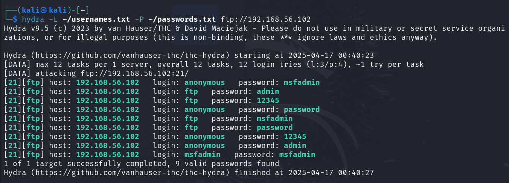
*Screenshot on finding the valid username-password combinations from the custom wordlists created prior.*

- Output Summary:

Hydra initiated 12 login attempts (3 usernames × 4 passwords), distributing the attempts across 12 parallel tasks for efficiency.

Hydra discovered 9 valid username-password combinations:

| Username         | Password                  |
|----------------|-----------------------------------|
| ftp             | 12345                         |
| anonymous       | msfadmin                      |
| anonymous       | admin                         |
| anonymous       | 12345                         |
| anonymous       | password                      |
| ftp             | msfadmin                      | 
| ftp             | admin                         |
| ftp             | password                      |
| msfadmin        | msfadmin                      |


Each of these was reported as a successful login to the FTP server, indicating weak authentication policies on the target machine.

This refined attack was also captured in Wireshark to observe how fewer, targeted login attempts appear on the network compared to a full-scale dictionary attack.

----

#### 3.4 FTP Login And Data Exfiltration

Using any of the valid credentials from the brute force attack e.g., ```msfadmin:msfadmin```, I logged into the FTP server to simulate post-exploitation activities, while capturing the activity in Wireshark for analysis.

----

#### 3.4.1 🛠 Create dummy files on Kali

I created and used dummy files to simulate common post-exploitation tasks such as uploading a malicious file to a target machine and exfiltrating sensitive data, by running the following in Kali terminal:

```
echo "This is a secret payload." > secret.txt

echo "Confidential report goes here." > confidential.pdf
```

As illustrated in the screenshot below:

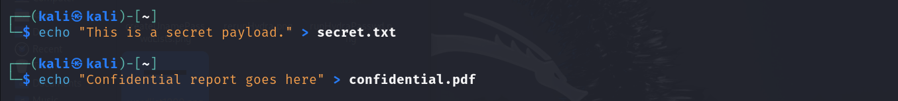
*Screenshot on creating dummy files via Kali terminal to be used for exfiltration purposes.*

1. secret.txt – Represents a malicious payload or script.
2. confidential.pdf – Represents sensitive information that an attacker machine (Kali) might try to exfiltrate.

-----

#### 3.4.2 📤 Login to FTP and upload payload to the target Metaspoitable 2

The secret.txt file was uploaded to the target machine (Metasploitable 2) to simulate a payload drop. This was done using FTP as we also know the credentials from the brute-force successful attack. 

To connect to FTP on Metaspoiltable, the following command was executed:

```
ftp 192.168.56.102
```

When prompted for:

1. Username: ```msfadmin```

2. Password: ```msfadmin```

There was then a successful login message "230 Login successful" as shown in the illustration below:

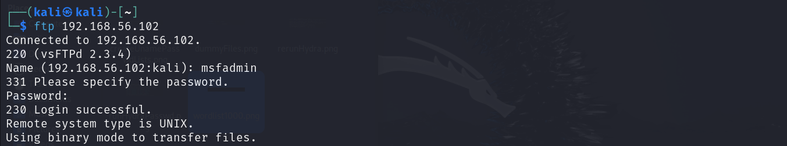
*Screenshot on the successful FTP login shell from Kali terminal.*

The successful login automatically directed to the FTP shell, where I uploaded the secret.txt file which represented a malicious payload by running:

```
put secret.txt
```

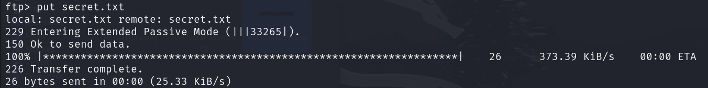
*Screenshot on uploading of secret.txt file in the FTP shell to used as a malicilious payload.*

From the screenshot above, 

1. 229 Entering Extended Passive Mode (|||33265|) - The server responds that it is switching to Extended Passive Mode (EPSV). The server opens a port `33265`, and the client connects to that server port to send the file.

2. 150 Ok to send data - The server is now preparing to transfer the file.

3. 226 Transfer complete - The file transfer has finished successfully. All data has been sent or received, and the connection for the transfer is being closed.

-----

#### 3.4.3 📥 Simulate Data Exfiltration from Metasploitable

With an active FTP session to the Metasploitable machine still running, I simulated data exfiltration by downloading a sensitive file (confidential.pdf) from the target system Metaspoiltable 2 by executing: 

```
get confidential.pdf
```

The screenshot below illustrates the data exfiltration process:

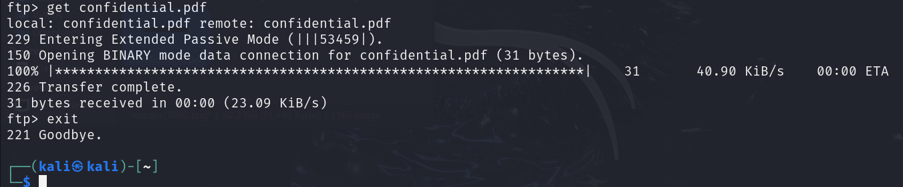. 
*Screenshot on FTP shell showing a successful getConfidential.pdf file transfer successful data exfiltration.*

Breakdown:

1. 229 Entering Extended Passive Mode (|||53459|) - The server responds that it is switching to Extended Passive Mode (EPSV).The server opens a port `53459`, and the client connects to that server port.

2. 150 Opening BINARY mode... — The server began transferring the file in binary mode.

3. 226 Transfer complete. — The file download finished successfully.

The data exfiltration was successful. This simulates how an attacker might steal files after gaining access to a system—by quietly pulling sensitive data through an unsecure protocol like FTP.

After downloading the file, the FTP connection was properly closed:

```
exit 
```

This shows ```Goodbye```, ends the session and returns you to the normal Kali shell.

--- 

### Step 4: 🛑 Stop The Capture And Save The PCAP

It is important to note that wireshark kept running all through the attack, so as to capture and record all traffic for analysis in the next stages. 

1. **To Stop the Capture**:
   - At the top-left corner, click the:
     `red square button`


2. **To Save the Capture**:
   - Click on the menu:
     `File` → `Save As`

     - Saved the packet capture as `bruteForce.pcapng`

3. **Click "OK"**:
   - The .pnapng file is saved in your desired folder.

---

### Step 5: 🔍 Analyzing the PCAP File

The goal in this step is to analyze the captured traffic in the saved `bruteForce.pcapng` file to identify suspicious behavior, brute-force login attempts, successful authentications, and potential post-exploitation activities such as file transfer - all captured during the simulated brute force.

---

#### 5.1 📥 Opening the PCAP

Launched Wireshark.

- Click on `File` → `Open`

Loaded the saved file `bruteForce.pcapng` as illustrated in the screenshot below:

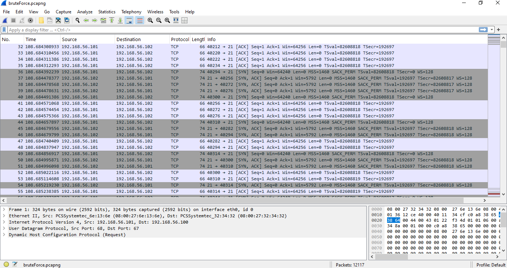
*Screenshot on loading bruteforce.pcapng file to open in Wireshark.*

A high volume of TCP traffic was observed between:

- Attacker (Kali): 192.168.56.101

- Target (Metasploitable): 192.168.56.102

---
#### 5.2 🧵 Filtering FTP Traffic

Applied Wireshark filter:

```
ftp || ftp-data
```

This isolated all FTP command and data packets as illustrated below:

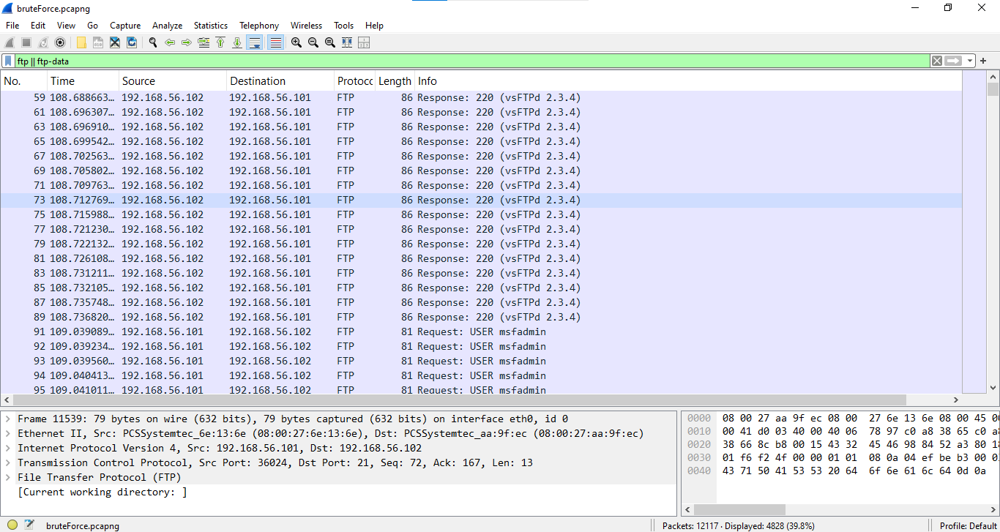
*Wireshark capture showing FTP filter to isolate FTP traffic.*

This analyzes ftp sessions end-to-end, from login to data movement.

---

#### 5.3 🔁 Detecting Brute-Force Attempts

From the ```ftp || ftp-data``` filter, repetitive `USER` and `PASS` commands was observed.

Sample packets from the PCAP:

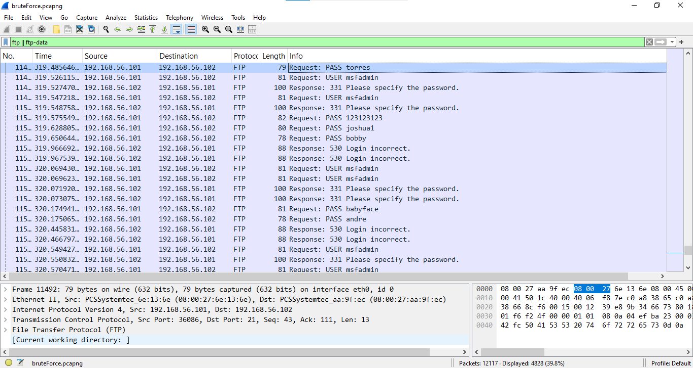
*Wireshark capture showing the FTP login process. The repetitive `USER` and `PASS` commands indicate brute force attempts.*

This confirmed automated brute-force behavior by the frequency and sequence of login attempts.

---

#### 5.4 ✅ Identifying Successful Logins

Applied filter:

```
ftp.response.code == 230
```

This filter shows only FTP response packets where the server sent code 230, which indicates a successful login.

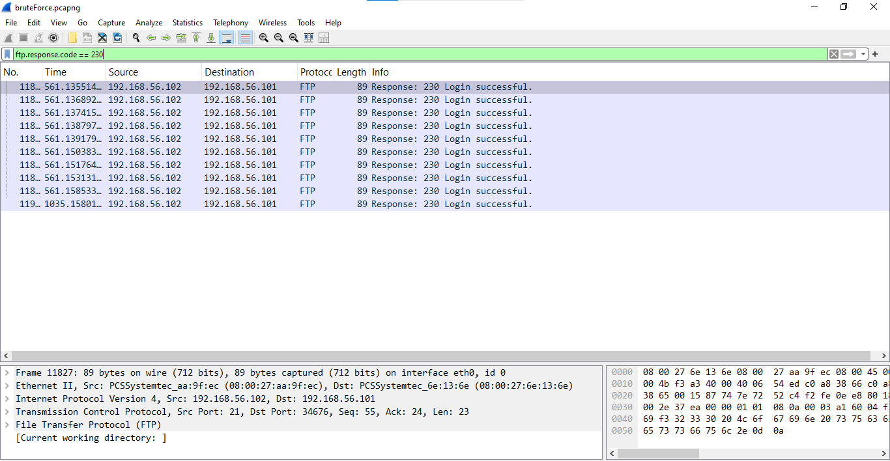
*Wireshark capture showing successful logins indicating valid credentials were used by the attacker.*

This analysis identified all successful FTP login attempts using the response code 230, which means "Login successful."

⚠️ Security Concerns Highlighed:

1. Brute Force Pattern Detected - Multiple successful logins occurring within milliseconds indicate that a brute-force or scripted login attack might have been used to guess valid credentials.

2. Insecure Protocol Usage - FTP does not encrypt traffic, meaning credentials were likely sent in plaintext and could be intercepted which allows credential sniffing.

3. Same Source Repeatedly Logging In - All logins originate from 192.168.56.102 attempting access on 192.168.56.101.

---

#### 5.5 📂 Evidence of File Transfer

This analysis focuses on identifying file upload operations over the FTP protocol. 

Filter used:

```
ftp.request.command == "STOR"
```

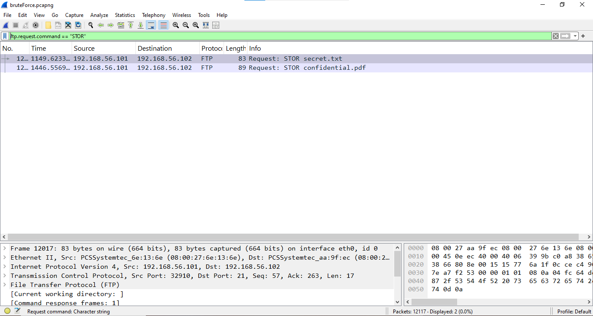
*Wireshark capture with `ftp.request.command == "STOR"` showing evidence of file transfer.*

Found the following activities:

- STOR secret.txt – file upload from the attacker machine Kali to target Metaspoiltable 2.

- STOR confidential.pdf - This shows another upload attempt, for a file named confidential.pdf.

This capture reveals potentially unauthorized file uploads over an insecure protocol. The attacker Kali machine attempted to upload two files to a destination FTP server. 

#### 🔍 Inferences:

Sensitive File Transfers: The filenames ```secret.txt``` and ```confidential.pdf``` suggest the file contents might be sensitive. This could be a red flag in a security audit.

Unencrypted Protocol: FTP is being used, which transmits data in cleartext, including file contents, commands, and possibly credentials. This poses a major security risk, especially for sensitive files.

Potential Insider Threat or Unauthorized Activity: If this packet capture was taken during an investigation such as a brute-force attempt, these uploads could indicate data exfiltration attempts.

#### 🛡️ Security Concerns Highlighted:

1. Cleartext FTP - Vulnerable to Eavesdropping.

2. Sensitive File Transfer - Possible Data Leak.

---

#### 5.6 📈 Attack Timeline (Flow Graph)

Using the Flow Graph makes it easier to present the attack narrative in incident reports and documentation. It visually connects the dots between actions and responses, demonstrating the effectiveness of intrusion detection through packet analysis.

---

#### 🪜 Steps to Generate a Flow Graph:

1. **Navigate to Flow Graph**:
   - Click on the menu:  
     `Statistics` → `Flow Graph`

2. **Configure the graph view**:
   - In the popup:
     - **Flow type**: Select `TCP flow`.
     - **Direction**: `All packets`.
     - **Show**: You can leave everything checked for a comprehensive view, or uncheck `Duplicate ACKs` and `Keep Alives` for cleaner output.

3. **Click "OK"**:
   - Wireshark will now generate a sequence diagram showing communication between the attacker and the FTP server.

---

#### 🔍 What to Look For in the Flow Graph:

- **Multiple login attempts**:
  - Repeated `USER` and `PASS` commands from attacker to target.
  - Clear evidence of brute-force automation.

- **Successful login**:
  - Noticeable shift from failed login responses to:
    ```
    230 Login successful
    ```

- **File upload/download events**:
  - `STOR secret.txt` for file upload.
  - `STOR confidential.pdf` for file upload.

#### 📋 Sample Extract:

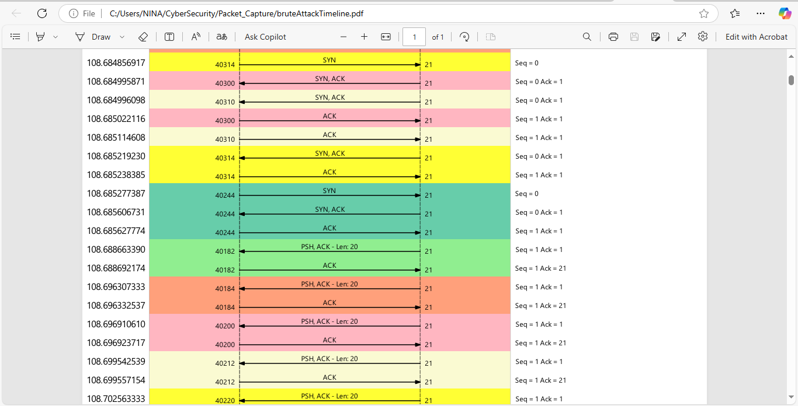

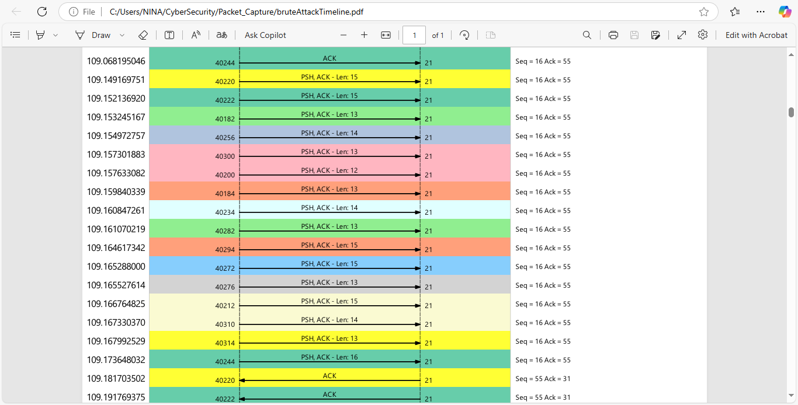

#### 📈 Key Observations:

 - Numerous SYN packets were sent in quick succession, indicating repeated attempts to initiate TCP connections to port 21.

 - For each SYN, the server responded with a SYN-ACK, and the attacker completed the handshake with an ACK.

 - Following the TCP handshake, the attacker sent PSH, ACK packets containing data payloads (likely login attempts).

 - The payload sizes vary (Len: 15, 22, 34, etc.), suggesting different combinations of username/passwords or command inputs.

 - This pattern repeated with high frequency and volume, consistent with brute-force behavior.

#### 🧠 Technical Indicators:

 - Target Port: 21 (FTP)

 - Flow Pattern: SYN → SYN-ACK → ACK → PSH/ACK (Payload) → ACK

 - Payload Variants: Multiple data lengths (13, 15, 26 bytes) were used during login attempts.

 - Session Closure: Frequent use of FIN-ACK and RST packets, signaling either completion or interruption of sessions—also typical of failed brute-force login loops.

 - New Connections: After many failed attempts, new connection attempts were observed from different source ports (e.g., 44822, 44824…), pointing to rotation in session attempts.

#### ⚠️ Analysis:

 - The captured flow graph clearly demonstrates a brute-force FTP login attack through repeated authentication attempts over TCP port 21. The repeated PSH, ACK exchanges with varying payload sizes suggest systematic username/password guessing, with sessions being rapidly established and closed.

---

## 📘 Conclusion

This project successfully demonstrated the process of capturing and analyzing network traffic to detect and investigate a brute-force FTP attack. By utilizing tools like Wireshark and Hydra, we were able to identify unauthorized access attempts, successful logins, and subsequent file transfer activities. The analysis provided valuable insights into the attack's methodology and highlighted the importance of continuous network monitoring and analysis in cybersecurity.

### 🔍 Key Findings

- **Brute-Force Attempts**: Multiple login attempts were observed, indicating a brute-force attack targeting the FTP service.

- **Successful Authentication**: Credentials such as `msfadmin:msfadmin` were successfully used to gain unauthorized access.

- **File Transfer Activities**: Post-authentication, files like `secret.txt` were uploaded, and attempts were made to download `confidential.pdf`, which failed due to file access issues.

- **Attack Timeline**: The flow of the attack—from initial access attempts to file transfer activities—was effectively visualized using Wireshark's Flow Graph feature.

### 🧠 Key Takeaways

- **Importance of Strong Credentials**: Weak or default credentials can be easily exploited; it's crucial to enforce strong password policies.

- **Monitoring and Detection**: Regular network traffic monitoring can aid in the early detection of unauthorized activities.

- **Tool Proficiency**: Familiarity with tools like Wireshark enhances the ability to analyze and interpret network data effectively.

- **Documentation**: Maintaining detailed records of analysis processes and findings is essential for incident response and future reference.

### 🔧 Remediation Measures

To mitigate and prevent brute-force attacks and unauthorized access, the following measures are recommended:

1. **Disable Anonymous FTP Access**  
   Ensure anonymous and guest accounts are disabled on all FTP servers unless absolutely necessary.

2. **Enforce Strong Password Policies**  
   Require complex passwords with a minimum length, use of symbols, uppercase/lowercase letters, and regular password rotation.

3. **Implement Account Lockout Policies**  
   Set up thresholds for failed login attempts to trigger account lockouts or IP blacklisting.

4. **Use Secure Protocols**  
   Replace FTP with secure alternatives like SFTP or FTPS that encrypt data in transit.

5. **Firewall Configuration**  
   Limit access to FTP services to trusted IP addresses using firewall rules.

6. **Deploy Intrusion Detection Systems (IDS)**  
   Use tools like Snort or Suricata to detect and alert on brute-force behavior or unusual login activity.

7. **Audit and Monitor Logs**  
   Continuously monitor server logs for repeated login failures, successful logins, and unusual file transfers.

8. **Regular Security Assessments**  
   Conduct vulnerability scans and penetration testing to identify weak points in your authentication mechanisms.

---

## 📎 Appendices

  #### A. Tools Used

  | Tool             | Purpose                     |
  |-----------------|-----------------------------------|
  | Wireshark        | For capturing and analyzing network traffic              |
  | Hydra            | To perform brute-force attacks on the FTP service.       |
  | Kali Linux       | Attacker system                                          |
  | Metasploitable 2 | Deliberately vulnerable target system                    |
  | Virtual Box      | Virtual lab environment                                  |


  #### B. IP Address Mapping

  | System             | IP Address                     |
  |-------------------|----------------------------------|
  | Kali Linux            | `192.168.56.101`       |
  | Metasploitable2       | `192.168.56.102`       |


  #### D. PCAP File

  Download Link: bruteForce.pcapng


  #### C. Sample Commands

- **Hydra Command**:
  ```
  hydra -L ~/usernames.txt -P ~/passwords.txt ftp://192.168.56.102
  ```

- **FTP Filter Command**:
  ```
  ftp || ftp-data
  ```

- **FTP Request Command**:
  ```
  ftp.request.command == "STOR"
  ```

---
> Click [here](https://github.com/ninahonyango/Elizabeth_P_A_Onyango) to go back to home page.
