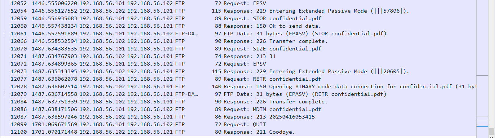

# FTP Brute-Force Attack Simulation With Data Exfiltration and Network Forensics Using Wireshark

## Project Overview

In this project, a brute-force attack was simulated on an FTP server and captured the network traffic using Wireshark to analyze key attack vectors and detect signs of data exfiltration.

The project was designed to help me understand common attack techniques, how to detect them, and the importance of proper network traffic analysis for threat detection.

---

## Tools & Technologies Used

- **Kali Linux** (Attacker VM).

- **Metasploitable2** (Victim VM).

- **FTP Service**: A vulnerable FTP service running on Metasploitable 2.

- **Hydra**: For conducting the brute-force attack on the FTP service.

- **Wireshark**: For capturing network traffic and analyzing the packets.

---

## Objectives

- Simulate a Real-World Brute-Force Attack.

- Capture Network Traffic Using Wireshark.

- Analyze Network Traffic for Attack Indicators.

- Perform Data Exfiltration Simulation.

- Evaluate Security Implications of FTP.

- Develop Packet Analysis Skills.

- Improve Threat Detection Techniques.

---

## Steps Taken

1. Virtual Lab Setup & Network Configuration.

2. Starting Capturing Network Traffic with Wireshark.

3. Attack Simulation (Brute Force FTP Login & Exfiltration).

4. Stopping the Capture and Saving The PCAP.

5. Analyzing the PCAP in Wireshark.

6. Reporting and Documentation.

---

### Step 1: Virtual Lab Setup & Network Configuration

#### Lab Configuration Overview

| Component       | Configuration                     |
|----------------|-----------------------------------|
| Host OS         | Windows 10                                                          |
| Attacker        | Kali Linux (VirtualBox VM)                                          |
| Target          | Metasploitable 2 (VirtualBox VM) - Intentionally Vulnerable         |
| Network Type    | Host-Only Adapter (VirtualBox Host-Only Ethernet Adapter)           |
| Attacker IP     | `192.168.56.101`                                                    |
| Target IP       | `192.168.56.102`                                                    | 

This configuration ensures that both virtual machines are on the same isolated network segment, enabling seamless communication between the attacker (Kali Linux) and the target (Metasploitable 2) while keeping the setup secure from external threats.

To ensure secure and isolated communication between the attacker and target machine, the network was configured using VirtualBox's "Host-Only Adapter" mode. This setup allows both virtual machines to interact with each other without any external internet access.


#### Verifying Connectivity

Once both virtual machines were configured and running, connectivity was verified by pinging Metasploitable2 IP from Kali terminal:

```
ping 192.168.56.102
```

The successful response from Kali terminal as shown in the screenshot below, confirmed that the virtual environment was properly isolated and communication between the VMs was working as expected.


*Kali terminal output showing network connection with Metasploitable2 VM.*

---

### Step 2: Starting Capturing Network Traffic with Wireshark

To monitor and analyze the network activity associated with the simulated brute-force attack and FTP data transfer, Wireshark was launched in Kali to capture live traffic on the network interface:

```
sudo wireshark 
```

"sudo" was used because Wireshark needs root privileges to capture packets, which prompted password for user "kali".

I then selected the appropriate network interface "eth0" used to communicate with the Metasploitable 2 VM and clicked the Start Capture button (blue shark fin icon) at the top-left to start the capture.

Wireshark was ready and waiting to record all incoming and outgoing network packets.

----

#### 2.1 Testing the Correct Network Interface in Wireshark.

After launching Wireshark, selecting the correct network interface and starting the packet capture, I tested the network interface by pinging Metasploitable target IP in Kali terminal:

```
ping 192.168.56.102
```


*Screenshot on testing the network interface `eth0` selected.*

As shown above:

1. Wireshark showed ICMP (Internet Control Message Protocol) packets:

- ICMP Echo Request - from Kali to Metasploitable2.

- ICMP Echo Reply - from Metasploitable2 back to Kali.

2. These ICMP packets related to the ping request which verified proper network adapter configuration, network connectivity between Kali Linux and Metasploitable2 VMs, and that Wireshark was correctly and actively capturing the traffic at the network interface level.

Wireshark kept running all through the attack so as to capture and record all traffic, including authentication attempts, login credentials, and file transfers for analysis in the later stages.

This step was essential to simulate and observe how real-world network attacks can be identified through packet-level inspection, making it a core part of analysis phase in the later stages.

---

### Step 3: Attack Simulation (Brute Force FTP Login & Exfiltration)

With Wireshark actively capturing traffic in the background, I proceeded to launch a Hydra brute-force attack on the FTP service running on Metasploitable 2, followed by manual FTP login and file transfer operations.

#### 3.1 Extracting rockyou.txt Wordlist
I used the RockYou wordlist to try the brute-force attack. This is a common wordlist for weak passwords. By default, the rockyou.txt is not extracted while installing Kali.

To extract rockyou.txt wordlist, the following command was executed to navigate to the directory where rockyou.txt is compressed:

```
cd /usr/share/wordlists
```

After navigating to the directory, rockyou.txt.gz (the compressed file) was extracted by running:

```
sudo gunzip rockyou.txt.gz
```

I then verified that the file has been extracted:

```
ls | grep rockyou
```

This returned "rockyou.txt", which verified that the worldlist was extracted successfully.

Below is a visual representation on how the rockyou.txt worldlist was extracted:


*Screenshot on extracting the compressed rockyou.txt file.*

#### 3.1 Launching Hydra to Brute-Force FTP Login

In this step, a simulated brute-force attack was performed against Metasploitable's FTP service.

The goal was to demonstrate how weak credentials can be discovered using automated tools and to capture this attack in Wireshark for forensic analysis.

The command below was executed in Kali terminal:

```
hydra -l msfadmin -P /usr/share/wordlists/rockyou.txt ftp://192.168.56.102
```

Breakdown of the command above:

1. ```hydra``` - invokes the Hydra tool, which is a fast and flexible password brute-forcer.

2. ```-l msfadmin``` - specifies the username to use - in this case, msfadmin.

3. ```-P /usr/share/wordlists/rockyou.txt``` - this is the path to the password list which tells Hydra to use the RockYou wordlist to try against the username msfadmin. -P is for password file. (rockyou.txt is a common wordlist of weak passwords).

4. ```ftp://192.168.56.102``` - specifies the protocol (ftp) and the target IP address (192.168.56.102) to attack.

Hydra will attempt to brute-force FTP login at target Metasploitable2 IP 192.168.56.102, trying the username "msfadmin" with every password in the RockYou wordlist.

Hydra took so long to find a username-password match. This is because when demonstrating brute force attacks for educational purposes, using the full rockyou.txt wordlist can be time-consuming and unnecessary. 

The rockyou.txt is classic, but very huge. It has 14+ million passwords, and Hydra will go through each one unless it finds a match then it stops, or is stopped manually. 

To speed up the process and make the demo more efficient, I stopped a smaller, truncated version of the wordlist was created and used as shown in the next sub-step. 

----

#### 3.2 Creating a Smaller Version of the rockyou.txt Wordlist

To create a smaller version of rockyou.txt wordlist, a working copy of the default rockyou.txt wordlist is made first. This was achieved by running:

```
cp /usr/share/wordlists/rockyou.txt ~/shortlist.txt
```

I then extracted the first 1000 passwords to create a lightweight list for quick testing:

```
head -n 1000 ~/shortlist.txt > ~/ftp-demo-list.txt
```

The "ftp-demo-list.txt" contains only the first 1000 passwords from rockyou.txt wordlist.


*Screenshot on creating a smaller version of rockyou.txt wordlist to be used for the brute-force attack.*

Using a shorter wordlist matters because it ensures faster execution, and supports resource-friendliness as it uses lower CPU and memory during the attack.

Lastly, I executed Hydra to brute force the FTP login using a specific username (msfadmin - a known default credentials for Metasploitable2) and the new, shorter password list created:

```
hydra -l msfadmin -P ~/ftp-demo-list.txt ftp://192.168.56.102
```


*Screenshot on re-running Hydra to brute-force FTP login using username 'msfadmin' and the ftp-demo-list.txt wordlist.*

The illustration above shows that there was "0 valid password found" after re-running Hydra with the shorter password list. None of the 1000 passwords matched the credentials for username msfadmin on the target system.

This result highlights a realistic limitation of brute force attacks: success is heavily dependent on the quality and relevance of the wordlist.

I didn't opt to use a larger wordlist segment (e.g., 10,000 entries or more) or perform a full brute force testing on the complete rockyou.txt due to the cost of time, speed, and system resources.

I customized a wordlist based on the username 'msfadmin' as illustrated in the next sub-step.

----

#### 3.3 Creating Custom Wordlists for the Brute-Force Attack

The default credentials for Metasploitable2 are usually:

`Username: msfadmin`

`Password: msfadmin`

To simulate a more targeted brute-force attack, custom wordlists were created for both usernames and passwords. These smaller, curated lists are often used in real-world scenarios where an attacker has prior knowledge about potential credentials, making the attack more efficient than using massive dictionaries such as the rockyou.txt. 

This was done by running:

```
echo -e "msfadmin\nftp\nanonymous" > ~/usernames.txt

echo -e "msfadmin\nadmin\n123456\npassword" > ~/passwords.txt
```

Breakdown:

1. The first command creates a file named usernames.txt in the home directory, containing:

   - msfadmin

   - ftp

   - anonymous

2. The second command creates a file named passwords.txt, containing:

   - msfadmin

   - admin

   - 123456

   - password

The -e flag with echo enables interpretation of backslash-escaped characters \n to format the entries on separate lines.

These custom lists were crafted based on:

1. Commonly known default credentials for Metasploitable2.

2. Frequently used weak passwords.

3. Service-specific usernames (ftp and anonymous).

By using smaller lists, I was able to test a focused brute-force scenario that simulates real-world credential stuffing or insider attacks.

These wordlists were then supplied to Hydra using the "-L" (for usernames) and "-P" (for passwords) flags in the following format:

```
hydra -L ~/usernames.txt -P ~/passwords.txt ftp://192.168.56.102
```


*Screenshot on finding valid username-password combinations from the custom wordlists created prior.*

Output Summary:

Hydra initiated 12 login attempts (3 usernames * 4 passwords), distributing the attempts across 12 parallel tasks for efficiency.

Hydra discovered 9 valid username-password combinations:

| Username         | Password                  |
|----------------|-----------------------------------|
| ftp             | 12345                         |
| anonymous       | msfadmin                      |
| anonymous       | admin                         |
| anonymous       | 12345                         |
| anonymous       | password                      |
| ftp             | msfadmin                      | 
| ftp             | admin                         |
| ftp             | password                      |
| msfadmin        | msfadmin                      |


Each of these was reported as a successful login to the FTP server, indicating weak authentication policies on the target machine.

This refined attack was also captured in Wireshark to observe how fewer, targeted login attempts appear on the network compared to a full-scale dictionary attack.

----

#### 3.4 FTP Login And Data Exfiltration

Using any of the valid credentials from the brute force attack ```msfadmin:msfadmin```, I logged into the FTP server to simulate post-exploitation activities, while capturing the activity in Wireshark.


#### 3.4.1 Creating dummy files on Kali

Dummy files were created to simulate post-exploitation tasks such as uploading a malicious file to a target machine and exfiltrating sensitive data, by running the following in Kali terminal:

```
echo "This is a secret payload." > secret.txt

echo "Confidential report goes here." > confidential.pdf
```


*Screenshot on creating dummy files via Kali terminal to be used for exfiltration purposes.*

1. secret.txt - represents a malicious payload or script.
2. confidential.pdf - represents sensitive information that the attacker machine (Kali) might try to exfiltrate.
-----

#### 3.4.2 Logging into FTP & uploading payload to the target Metasploitable2

The secret.txt file was uploaded to Metasploitable2 to simulate a payload drop. This was done using FTP as we already know the credentials from the brute-force successful attack. 

To connect to FTP on Metaspoiltable, the following command was executed:

```
ftp 192.168.56.102
```

When prompted for:

1. Username: ```msfadmin```

2. Password: ```msfadmin```

There was then a successful login message "230 Login successful" as shown below:


*Screenshot on the successful FTP login shell from Kali terminal.*

The successful login automatically directed to the FTP shell, where the secret.txt file was uploaded which represented a malicious payload by running:

```
put secret.txt
```


*Screenshot on uploading of secret.txt file in the FTP shell to used as a malicilious payload.*

From the screenshot above, 

1. 229 Entering Extended Passive Mode ( |||33265| ) - The server responds that it is switching to Extended Passive Mode (EPSV). The server opens a port `33265`, and the client connects to that server port to send the file.

2. 150 Ok to send data - The server is now preparing to transfer the file.

3. 226 Transfer complete - The file transfer has finished successfully. All data has been received, and the connection for the transfer is being closed.

-----

#### 3.4.3 Simulating Data Exfiltration from Metasploitable2

With an active FTP session to the Metasploitable machine still running, data exfiltration was simulated by downloading the sensitive file (confidential.pdf) from the target system Metasploitable2: 

```
get confidential.pdf
```

The screenshot below illustrates the data exfiltration process:


*Screenshot on FTP shell showing a successful getConfidential.pdf file transfer successful data exfiltration.*

Output breakdown:

1. 229 Entering Extended Passive Mode ( |||53459| ) - The server responds that it is switching to Extended Passive Mode (EPSV). The server opens a port `53459`, and the client connects to that server port.

2. 150 Opening BINARY mode... - The server began transferring the file in binary mode.

3. 226 Transfer complete. - The file download finished successfully.

After downloading the file, the FTP connection was properly closed:

```
exit 
```

This shows "Goodbye", ends the session and returns to the normal Kali shell.

The data exfiltration was successful, simulating how an attacker may steal files after gaining access to a system and quietly pulling sensitive data through an unsecure protocol such as FTP.

--- 

### Step 4: Stopping The Capture & Saving The PCAP

It is important to note that wireshark kept running all through the attack, so as to capture and record all traffic for analysis in the subsequent stages. 


1. **To Stop the Capture**:
   - At the top-left corner, click the:
     `red square button`


2. **To Save the Capture**:
   - Click on the menu:
     `File` > `Save As`

     - Saved the packet capture as `bruteForce.pcapng`

3. **Click "OK"**:
   - The .pnapng file was then saved in the project folder.

---

### Step 5: Analyzing the PCAP File

The goal in this step is to analyze the captured traffic in bruteForce.pcapng file to identify suspicious behavior, brute-force login attempts, successful authentications, and potential post-exploitation activities such as file transfer.

To open the PCAP, wireshark was launched:

- Click on `File` > `Open`

Loaded the saved file `bruteForce.pcapng` as illustrated in the screenshot below:


*Screenshot on loading bruteforce.pcapng file to open in Wireshark.*

From the screenshot above, high volume of TCP traffic was observed between:

- Attacker (Kali): 192.168.56.101

- Target (Metasploitable2): 192.168.56.102

---

#### 5.1 Filtering FTP Traffic

To filter FTP traffic, the following Wireshark filter was applied:

```
ftp || ftp-data
```


*Wireshark packet capture showing FTP filter to isolate FTP traffic.*

This isolated all FTP command and data packets, and analyzes ftp sessions end-to-end, from login to data movement.

---

#### 5.2 Detecting Brute-Force Attempts

From the ```ftp || ftp-data``` filter, repetitive `USER` and `PASS` commands were observed.

Sample packets from the PCAP:


*Wireshark packet capture showing the FTP login process. The repetitive USER and PASS commands indicate brute force attempts.*

To filter brute-force traffic showing every password sent by Hydra to the Metasploitable2 server, the following filter was used:

```
ftp.request.command == "PASS"
```


*Wireshark packet capture showing brute-force attempts using ftp.request.command == "PASS" filter, showing every password sent to Hydra to the Metasploitable2 server.*

This confirmed automated brute-force behavior by the frequency and sequence of login attempts.

---

#### 5.3 Identifying Successful Logins

To identify successful ftp logins, the following filter was applied:

```
ftp.response.code == 230
```


*Wireshark capture showing successful logins indicating valid credentials were used by the attacker.*

This filter shows only FTP response packets where the server sent code 230, which means "Login successful".

From the filters applied, some of the security concerns highlighed include:

1. Brute Force Pattern Detected - Multiple successful logins occurring within milliseconds indicate that a brute-force login attack might have been used to guess valid credentials.

2. Insecure Protocol Usage - FTP does not encrypt traffic. This means that credentials were sent in plaintext, leading to credential sniffing, as evidently seen in the packet capture.

3. Same Source Repeatedly Logging In - All logins originate from 192.168.56.102, the attacker machine attempting access on 192.168.56.101, the target.

---

#### 5.4 Evidence of File Transfer

This analysis focuses on identifying file upload operations over the FTP protocol. 


*Wireshark packet capture of an FTP EPSV reponse.*

The screenshot above, shows a packet with an FTP Extended Passive Mode (EPSV) response. The client Kali sent an EPSV command to Metasploitable's FTP server. The server responded with `229 Entering Extended Passive Mode (|||20605|)`. 

This happens because FTP needs two connections:

- Control connection (TCP port 21) - for login, commands, etc.

- Data connection - for file transfers (LIST, STOR, RETR)

In passive mode:

- The FTP server tells the client Kali: "Hey, open a new data connection to me on port 20605"

- 20605 is the random port the server opened for the data transfer.

The client Kali then connects to port 20605, followed by a STOR, RETR or LIST command, then actual data transfer happens as seen in the subsequent packets in the same screenshot.

Filter used:

```
ftp.request.command == "STOR" || ftp.request.command == "RETR"
```


*Wireshark capture with `ftp.request.command == "STOR"` showing evidence of file transfer.*

From the filter applied above, the following activities were found:

- STOR secret.txt - file upload from the attacker machine Kali to target Metaspoiltable 2.

- STOR confidential.pdf - This shows another upload attempt, for a file named confidential.pdf.

- RETR confidential.pdf - This shows a file download from the target Metasploitable2 to the attacker Kali.

This capture reveals potentially unauthorized file transfer over an insecure protocol. The attacker Kali machine attempted to upload and download files from Metasploitable FTP server. 

#### Inferences:

Sensitive File Transfers - The filenames "secret.txt" and "confidential.pdf" suggest the file contents may be sensitive. This could be a red flag in a security audit.

Unencrypted Protocol - FTP is being used, which transmits data in cleartext, including file contents, commands and credentials. This poses a major security risk, especially for sensitive files.

Potential Unauthorized Activity - If this packet capture was taken during an investigation such as a brute-force attempt, these uploads could indicate data exfiltration attempts and possible data leak.

#### 5.6 Attack Timeline (Flow Graph)

Using the Flow Graph makes it easier to present the attack narrative in incident reports and documentation.

It visually connects the dots between actions and responses, demonstrating the effectiveness of intrusion detection through packet analysis.


#### Steps to Generate a Flow Graph:

1. **Navigate to Flow Graph**:
   - Click on the menu:  
     `Statistics` > `Flow Graph`

2. **Configure the graph view**:
   - In the popup:
     - **Flow type**: Select `TCP flow`.
     - **Direction**: `All packets`.
     - **Show**: I left everything checked for a comprehensive view.

3. **Click "OK"**:
   - Wireshark will now generate a sequence diagram showing communication between the attacker Kali and Metasploitabe2 FTP server.

---

#### What to Look For in the Flow Graph:

- **Multiple login attempts**:
  - Repeated `USER` and `PASS` commands from attacker to target.
  - Clear evidence of brute-force automation.

- **Successful login**:
  - Noticeable shift from failed login responses to "230 Login successful".
    
- **File upload and download events**:
  - `STOR secret.txt` for file upload.
  - `STOR confidential.pdf` for file upload.

#### Sample Extract of the Flow Graph:


#### Key Observations:

 - Numerous SYN packets were sent in quick succession, indicating repeated attempts to initiate TCP connections to port 21.

 - For each SYN, the server responded with a SYN-ACK, and the attacker completed the handshake with an ACK.

 - Following the TCP handshake, the attacker sent PSH, ACK packets containing data payloads (likely login attempts).

 - The payload sizes vary (Len: 15, 22, 34, etc.), suggesting different combinations of username/passwords or command inputs.

 - This pattern repeated with high frequency and volume, consistent with brute-force behavior.

#### Technical Indicators:

 - Target Port: 21 (FTP)

 - Flow Pattern: SYN > SYN-ACK > ACK > PSH/ACK (Payload) > ACK

 - Payload Variants: Multiple data lengths (13, 15, 26 bytes) were used during login attempts.

 - Session Closure: Frequent use of FIN-ACK and RST packets, signaling either completion or interruption of sessions, also typical of failed brute-force login loops.

 - New Connections: After many failed attempts, new connection attempts were observed from different source ports (e.g., 44822, 44824…), pointing to rotation in session attempts.

#### Analysis:

 - The captured flow graph clearly demonstrates a brute-force FTP login attack through repeated authentication attempts over TCP port 21.
 
 - The repeated PSH, ACK exchanges with varying payload sizes suggest systematic username/password guessing, with sessions being rapidly established and closed.

---

## Conclusion

This project successfully demonstrated the process of capturing and analyzing network traffic to detect and investigate a brute-force FTP attack. By utilizing tools like Wireshark and Hydra, I was able to identify unauthorized access attempts, successful logins, and subsequent file transfer activities. The analysis provided valuable insights into the attack's methodology and highlighted the importance of continuous network monitoring and analysis in cybersecurity.

### Key Findings

- **Brute-Force Attempts**: Multiple login attempts were observed, indicating a brute-force attack targeting the FTP service.

- **Successful Authentication**: Credentials such as "msfadmin:msfadmin" were successfully used to gain unauthorized access.

- **File Transfer Activities**: Post-authentication, files like "secret.txt" were uploaded, and attempts were made to download "confidential.pdf".

- **Attack Timeline**: The flow of the attack from initial access attempts to file transfer activities, was effectively visualized using Wireshark's Flow Graph feature.

- **Attack Summary**: A brute-force attack was executed using Hydra targeting the FTP service on Metasploitable2 of IP 192.168.56.102. The attacker machine Kali of IP 192.168.56.101 attempted multiple logins using the username msfadmin and a password wordlist. Wireshark revealed a successful login using the password msfadmin, followed by manual FTP file transfers (RETR, STOR). All traffic was unencrypted, exposing credentials and data in transit.

### Key Takeaways

- **Importance of Strong Credentials**: Weak or default credentials can be easily exploited; it's crucial to enforce strong password policies.

- **Monitoring and Detection**: Regular network traffic monitoring can aid in the early detection of unauthorized activities.

- **Tool Proficiency**: Familiarity with tools like Wireshark enhances the ability to analyze and interpret network data effectively.

- **Documentation**: Maintaining detailed records of analysis processes and findings is essential for incident response and future reference.

### Remediation Measures

To mitigate and prevent brute-force attacks and unauthorized access, the following measures are recommended:

1. **Disable Anonymous FTP Access**  
   Ensure anonymous and guest accounts are disabled on all FTP servers unless absolutely necessary.

2. **Enforce Strong Password Policies**  
   Require complex passwords with a minimum length, use of symbols, uppercase/lowercase letters, and regular password rotation.

3. **Implement Account Lockout Policies**  
   Set up thresholds for failed login attempts to trigger account lockouts or IP blacklisting.

4. **Use Secure Protocols**  
   Replace FTP with secure alternatives like SFTP or FTPS that encrypt data in transit.

5. **Firewall Configuration**  
   Limit access to FTP services to trusted IP addresses using firewall rules.

6. **Deploy Intrusion Detection Systems (IDS)**  
   Use tools like Snort or Suricata to detect and alert on brute-force behavior or unusual login activity.

7. **Audit and Monitor Logs**  
   Continuously monitor server logs for repeated login failures, successful logins, and unusual file transfers.

8. **Regular Security Assessments**  
   Conduct vulnerability scans and penetration testing to identify weak points in your authentication mechanisms.


> *Click [here](https://github.com/ninahonyango/Packet-Capture-Analysis/blob/main/FTPBrute-forceCybersecurityInvestigationReport.pdf) to view the FTP Brute-force Investigation Report.*

---

> *Click [here](https://github.com/ninahonyango/Elizabeth_P_A_Onyango) to go back to Portfolio.*
